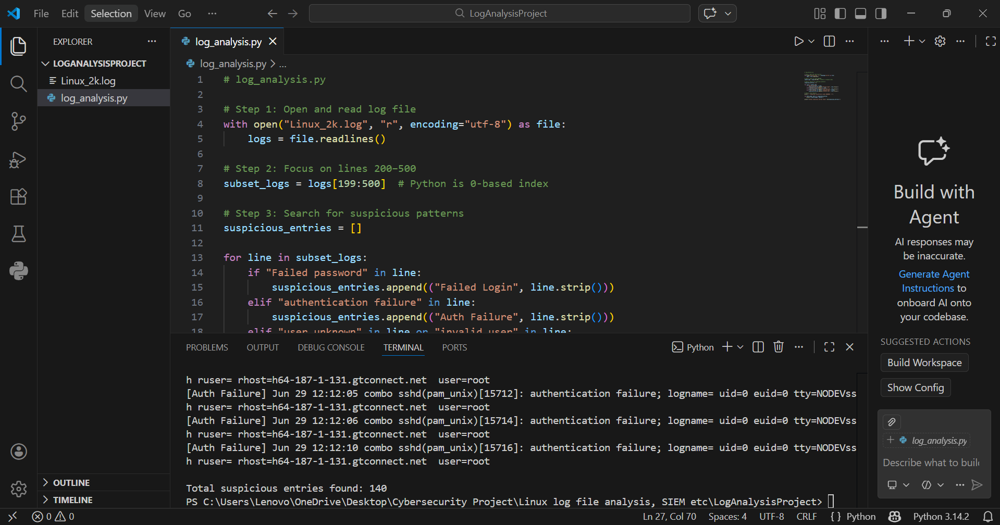
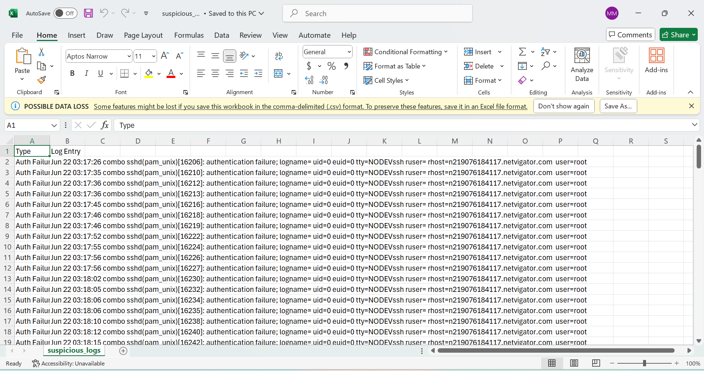
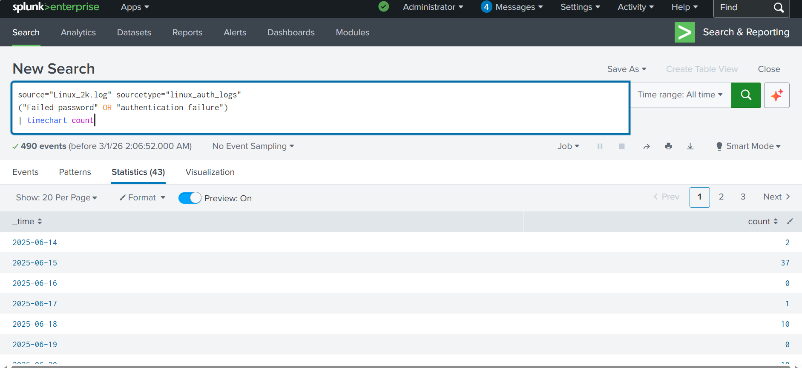
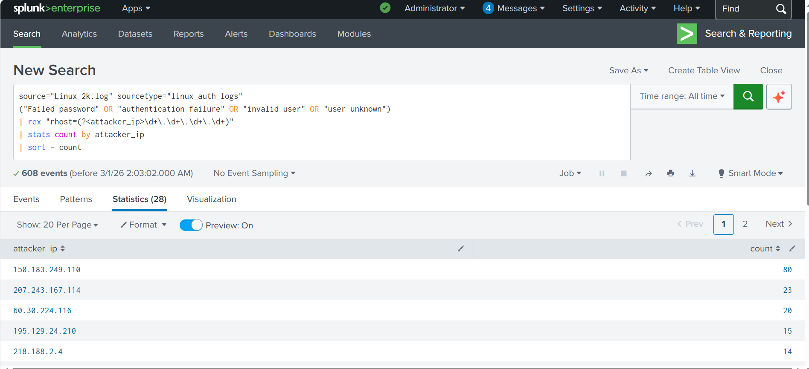
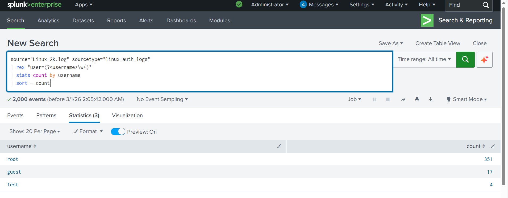
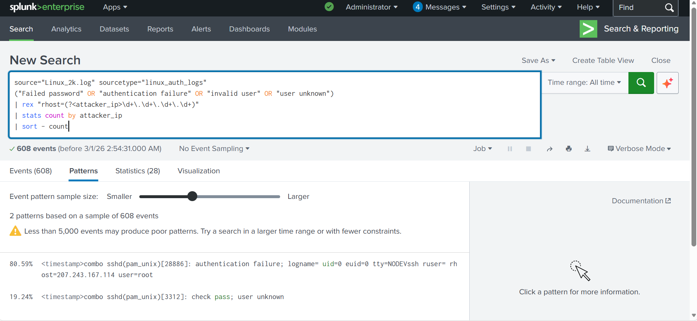

# Linux Log File Analysis, Automation, and SIEM Visualization

## 📌 Project Overview

This project simulates a Security Operations Center (SOC) workflow by analyzing Linux authentication logs to identify suspicious SSH login activity. The objective is to detect potential unauthorized access attempts through both manual analysis and automated detection techniques.

---

## 🎯 Project Objectives

### Objective 1 - Manual Log Analysis

- Review Linux authentication logs
- Identify repeated failed SSH login attempts
- Detect suspicious login behavior from external hosts
- Extract authentication failure events for analysis
---

### Objective 2 - Log Analysis Automation (Python)

- Extract specific log ranges
- Detect authentication failures automatically
- Identify unknown user login attempts
- Generate CSV reports for security analysis

---

### Objective 3 - SIEM Visualization (Splunk)

- Ingest Linux authentication logs into Splunk
- Filter authentication-related events
- Identify suspicious login patterns
- Generate visual insights from security events
- Integrate manual and automated findings into SIEM workflows

## 🛡️ Security Relevance

This project supports:

- Log Monitoring and Review
- Detection of Unauthorized Access Attempts
- Continuous Monitoring Practices

Relevant to:

- ISO 27001 A.8.15 – Logging
- ISO 27001 A.8.16 – Monitoring Activities
- CIS Control 8 – Audit Log Management

 
 ### 📸 Initial Authentication Log Review (First 20–40 Lines)

The first 20–40 lines of the Linux authentication log file were reviewed using VS Code to identify authentication-related events such as login failures and unknown users. Relevant entries were highlighted for further analysis in accordance with SOC monitoring procedures.


---

### 🔎 Step 3 — Identify Suspicious Events

After reviewing the initial log entries, suspicious authentication behavior was identified by analyzing repeated login failures and invalid user attempts.

Key indicators observed:

- Multiple failed SSH login attempts occurring within seconds
- Repeated authentication failures targeting the **root** account
- Login attempts from the same external host/IP address
- "user unknown" events indicating attempts to access non-existent accounts

These patterns strongly suggest a potential **brute-force attack** or automated login scanning activity, which is a common threat monitored by SOC analysts.

#### Evidence from Log Review


---

## Step 4 — Organizing Security Findings

To better visualize suspicious authentication activity, extracted log events were organized into a structured analysis table using spreadsheet tooling.

This allowed identification of repeated login attempts, attacker source patterns, and automated brute-force behavior.

### Organized Authentication Events


---

### Key Observations

- Multiple authentication failures originated from the same external IP addresses.
- Rapid sequential login attempts indicate automated brute-force activity.
- Several unknown user login attempts suggest username enumeration.
- Activity occurred in bursts, consistent with scripted attacks.

---
---

## – Step 5 Summary of Findings

The manual analysis of Linux authentication logs revealed multiple failed SSH login attempts originating from several external hosts. A significant concentration of authentication failures was observed from the IP address **218.188.2.4**, followed by additional attempts from other external domains including **061092085098.ctinets.com** and **d211-116-254-214.rev.krline.net**.

The repeated login failures occurred within very short time intervals and targeted non-existent or unknown user accounts, indicating automated authentication attempts rather than legitimate user activity. The high frequency and sequential nature of these events strongly suggest brute-force or credential-enumeration behavior.

No successful authentication events associated with these sources were identified during the analyzed timeframe, indicating that the attack attempts were unsuccessful. However, the persistence and pattern of retries demonstrate active external probing against the SSH service.

Overall, the findings highlight the importance of continuous log monitoring, access control hardening, and automated detection mechanisms to identify and respond to unauthorized access attempts in real time.
## Objective 2 – Automated Log Analysis (Python)

A Python script was developed to automatically analyze Linux authentication logs and detect suspicious activity.

## Step 1: Execute the Log Analysis Script

The Python script was executed in VS Code to automatically analyze Linux authentication logs between lines 200 and 500.

The script successfully detected multiple suspicious authentication events including failed logins and unknown user attempts.
### Script Execution Output

The output confirms that the automation script successfully identified suspicious authentication activity within the selected log range.
## Step 2: Verify CSV Export in Excel

The exported CSV file was opened in Microsoft Excel to verify that suspicious log entries were successfully saved in a structured and readable format.

The results confirm that authentication events were correctly exported into columns, enabling easier filtering, investigation, and reporting.



## 🔎 Splunk Log Analysis — Suspicious Authentication Activity

## Overview

In this objective, **Splunk Enterprise** was used to ingest and analyze Linux authentication logs previously examined through manual and automated methods.

The goal was to simulate a **Security Operations Center (SOC)** workflow by identifying suspicious authentication activity at scale using SIEM capabilities such as searching, filtering, and event visualization.

The `Linux_2k.log` dataset was uploaded into Splunk and indexed for investigation.

### Data Ingestion

The `Linux_2k.log` dataset was uploaded into Splunk using the **Add Data** feature.  
Splunk automatically detected the log structure and indexed approximately 2,000 events.

Key configuration:
- Source: `Linux_2k.log`
- Sourcetype: `linux_auth_logs`
- Index: Default
- Host: Local system constant value

This allowed Splunk to normalize and make the log data searchable.

---

### Search and Filtering

To identify suspicious authentication behavior, I executed the following SPL query:

```spl
source="Linux_2k.log" sourcetype="linux_auth_logs"
("Failed password" OR "authentication failure" OR "invalid user" OR "user unknown")
```
## Analysis Performed

Instead of reviewing logs individually, Splunk enabled analysis across three key investigation dimensions:

### 1️⃣ Time-Based Analysis

The event timeline visualization revealed clusters of authentication failures occurring within short time intervals.

This pattern suggests:

- Automated login attempts  
- Possible brute-force activity  
- Repeated connection retries from external hosts  

Temporal grouping allows analysts to quickly detect attack bursts that would be difficult to notice manually.


---

### 2️⃣ Attacker Identification (Source Hosts / IPs)

Log entries contained remote host information attempting authentication against the system.

Observations included:

- Repeated attempts originating from the same remote hosts  
- External IP addresses targeting privileged accounts  
- High-frequency login failures from single sources  

This behavior aligns with reconnaissance or credential-guessing attacks.


---

### 3️⃣ Targeted Users Analysis

The logs showed authentication attempts primarily targeting:

- `root` accounts  
- Invalid or unknown usernames  

Indicators:

- Attempts against privileged users increase risk severity  
- Unknown users indicate automated username enumeration  

These patterns are commonly associated with unauthorized access attempts.


---

## Key Findings

- Hundreds of authentication failures were detected.  
- Events occurred in repeated bursts over time.  
- Multiple attempts targeted privileged accounts.  
- Attack patterns matched typical brute-force indicators.

## Visualization and Threat Analysis in Splunk

After executing the SPL search query, Splunk was used to analyze authentication activity through multiple investigation views commonly used in Security Operations Centers (SOC).

The objective was to transform raw log data into actionable security insights by identifying attack patterns, sources, and behavioral trends.

---

### Events View — Identifying Suspicious Activity

The **Events** tab displays individual log entries matching the search criteria.

Analysis revealed:

- Repeated failed login attempts
- Continuous targeting of the **root** account
- Multiple authentication failures originating from the same external IP address
- Attempts occurring within very short time intervals

One source IP (`207.243.167.114`) appeared repeatedly attempting authentication against privileged accounts, indicating likely brute-force behavior.

This represents an immediate SOC investigation trigger.

---

### Patterns View — Confirming Repetitive Behavior

Switching to the Patterns tab allowed Splunk to automatically group similar log events.

A dominant pattern emerged:

"Failed password for root"

This confirms that authentication failures were not random events but systematic attempts using the same attack method.

Pattern clustering helps analysts quickly validate malicious automation without manually reviewing thousands of logs.


---

### Statistics View — Identifying Top Attack Sources

The **Statistics** tab was used to aggregate events by key investigation fields such as:

- Source IP address
- Targeted user accounts
- Event frequency

Findings included:

- Certain IP addresses generated significantly higher event counts
- The **root** account was consistently targeted
- Attack attempts originated from external hosts

This aggregation enables rapid identification of the most active attackers.

---

### Visualization View — Attack Timeline Analysis

In the **Visualization** tab, a line chart was created to plot authentication failures over time.

The timeline revealed:

- Sharp spikes in authentication failures
- Bursty activity occurring within short periods
- Repeated attack waves rather than isolated incidents

These characteristics strongly indicate automated brute-force attempts.

---

### Security Interpretation

The combined analysis demonstrates:

- Time-based attack bursts
- Repeated targeting of privileged accounts
- Automated credential-guessing behavior
- Consistent attacker source activity

This workflow illustrates how SIEM platforms like Splunk enable analysts to detect threats at scale by correlating events across time, users, and attacker sources.

---

### SOC Value Demonstrated

This exercise simulates a real-world SOC investigation workflow:

1. Ingest logs into SIEM
2. Filter suspicious activity using SPL queries
3. Identify attackers and targets
4. Visualize attack patterns
5. Produce actionable security findings

Splunk significantly reduces analysis time compared to manual log review while improving threat detection accuracy.
