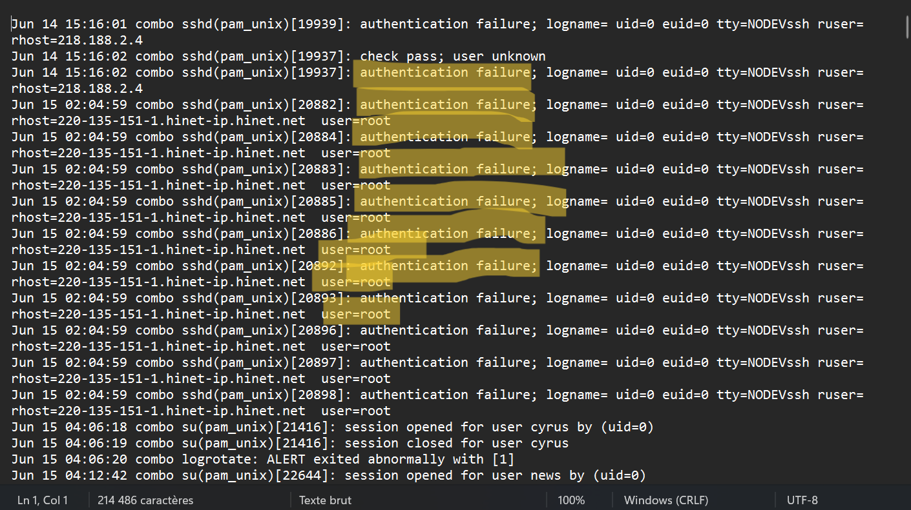

# Linux Log File Analysis, Automation, and SIEM Visualization

## 📌 Project Overview

This project simulates a Security Operations Center (SOC) workflow by analyzing Linux authentication logs to identify suspicious SSH login activity. The objective is to detect potential unauthorized access attempts through both manual analysis and automated detection techniques.

---

## 🎯 Project Objectives

### Objective 1 - Manual Log Analysis

- Review Linux authentication logs
- Identify repeated failed SSH login attempts
- Detect suspicious login behavior from external hosts
- Extract authentication failure events for analysis
---

### Objective 2 - Log Analysis Automation (Python)

- Extract specific log ranges
- Detect authentication failures automatically
- Identify unknown user login attempts
- Generate CSV reports for security analysis

---

### Objective 3 - SIEM Visualization (Splunk)

- Ingest Linux authentication logs into Splunk
- Filter authentication-related events
- Identify suspicious login patterns
- Generate visual insights from security events
- Integrate manual and automated findings into SIEM workflows

## 🛡️ Security Relevance

This project supports:

- Log Monitoring and Review
- Detection of Unauthorized Access Attempts
- Continuous Monitoring Practices

Relevant to:

- ISO 27001 A.8.15 – Logging
- ISO 27001 A.8.16 – Monitoring Activities
- CIS Control 8 – Audit Log Management

 
 ### 📸 Initial Authentication Log Review (First 20–40 Lines)

The first 20–40 lines of the Linux authentication log file were reviewed using VS Code to identify authentication-related events such as login failures and unknown users. Relevant entries were highlighted for further analysis in accordance with SOC monitoring procedures.

