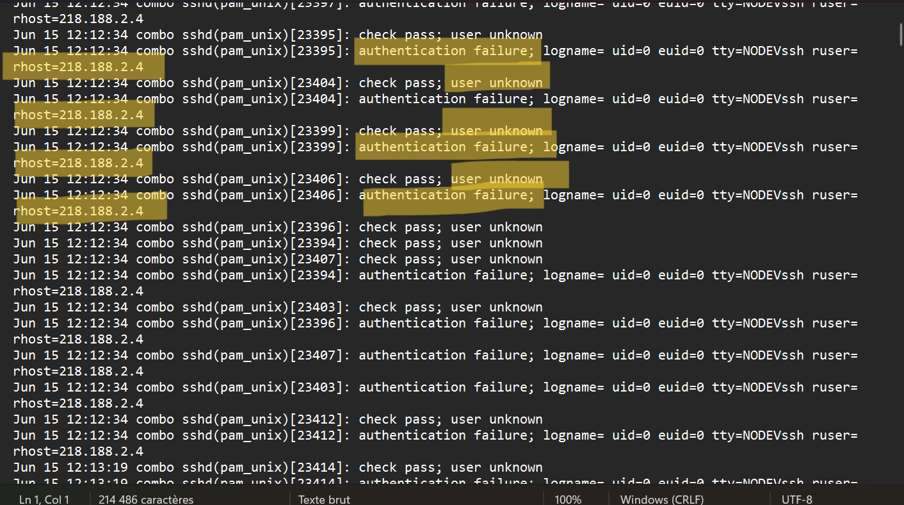
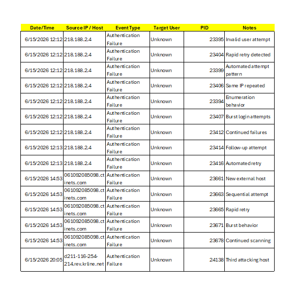
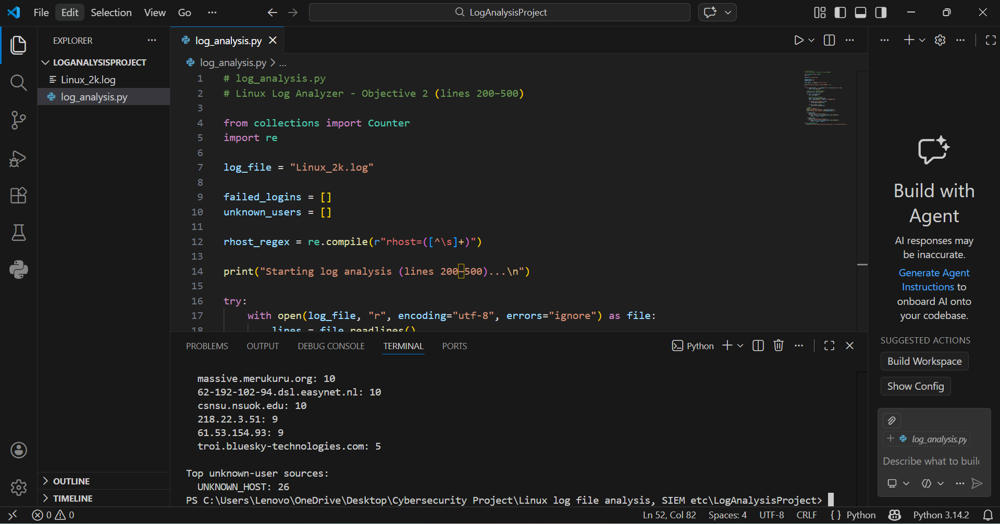

# Linux Log File Analysis, Automation, and SIEM Visualization

## 📌 Project Overview

This project simulates a Security Operations Center (SOC) workflow by analyzing Linux authentication logs to identify suspicious SSH login activity. The objective is to detect potential unauthorized access attempts through both manual analysis and automated detection techniques.

---

## 🎯 Project Objectives

### Objective 1 - Manual Log Analysis

- Review Linux authentication logs
- Identify repeated failed SSH login attempts
- Detect suspicious login behavior from external hosts
- Extract authentication failure events for analysis
---

### Objective 2 - Log Analysis Automation (Python)

- Extract specific log ranges
- Detect authentication failures automatically
- Identify unknown user login attempts
- Generate CSV reports for security analysis

---

### Objective 3 - SIEM Visualization (Splunk)

- Ingest Linux authentication logs into Splunk
- Filter authentication-related events
- Identify suspicious login patterns
- Generate visual insights from security events
- Integrate manual and automated findings into SIEM workflows

## 🛡️ Security Relevance

This project supports:

- Log Monitoring and Review
- Detection of Unauthorized Access Attempts
- Continuous Monitoring Practices

Relevant to:

- ISO 27001 A.8.15 – Logging
- ISO 27001 A.8.16 – Monitoring Activities
- CIS Control 8 – Audit Log Management

 
 ### 📸 Initial Authentication Log Review (First 20–40 Lines)

The first 20–40 lines of the Linux authentication log file were reviewed using VS Code to identify authentication-related events such as login failures and unknown users. Relevant entries were highlighted for further analysis in accordance with SOC monitoring procedures.

---

### 🔎 Step 3 — Identify Suspicious Events

After reviewing the initial log entries, suspicious authentication behavior was identified by analyzing repeated login failures and invalid user attempts.

Key indicators observed:

- Multiple failed SSH login attempts occurring within seconds
- Repeated authentication failures targeting the **root** account
- Login attempts from the same external host/IP address
- "user unknown" events indicating attempts to access non-existent accounts

These patterns strongly suggest a potential **brute-force attack** or automated login scanning activity, which is a common threat monitored by SOC analysts.

#### Evidence from Log Review

---

## Step 4 — Organizing Security Findings

To better visualize suspicious authentication activity, extracted log events were organized into a structured analysis table using spreadsheet tooling.

This allowed identification of repeated login attempts, attacker source patterns, and automated brute-force behavior.

### Organized Authentication Events

---

### Key Observations

- Multiple authentication failures originated from the same external IP addresses.
- Rapid sequential login attempts indicate automated brute-force activity.
- Several unknown user login attempts suggest username enumeration.
- Activity occurred in bursts, consistent with scripted attacks.

---
---

## – Step 5 Summary of Findings

The manual analysis of Linux authentication logs revealed multiple failed SSH login attempts originating from several external hosts. A significant concentration of authentication failures was observed from the IP address **218.188.2.4**, followed by additional attempts from other external domains including **061092085098.ctinets.com** and **d211-116-254-214.rev.krline.net**.

The repeated login failures occurred within very short time intervals and targeted non-existent or unknown user accounts, indicating automated authentication attempts rather than legitimate user activity. The high frequency and sequential nature of these events strongly suggest brute-force or credential-enumeration behavior.

No successful authentication events associated with these sources were identified during the analyzed timeframe, indicating that the attack attempts were unsuccessful. However, the persistence and pattern of retries demonstrate active external probing against the SSH service.

Overall, the findings highlight the importance of continuous log monitoring, access control hardening, and automated detection mechanisms to identify and respond to unauthorized access attempts in real time.
## Objective 2 – Automated Log Analysis (Python)

A Python script was developed to automatically analyze Linux authentication logs and detect suspicious activity.

### Script Execution Output

## Step 6: Automated Log Analysis Summary

A Python-based log analysis script was developed to automate the detection of suspicious authentication activity within Linux system logs.

The script analyzed log entries between lines **200 and 500** of the `Linux_2k.log` dataset and detected multiple failed login attempts originating from several external hosts. The repeated authentication failures from the same sources suggest potential **brute-force** or **automated credential-guessing attacks**.

Additionally, several events contained **unknown user** authentication attempts, indicating possible **username enumeration activity**, where attackers attempt to discover valid system accounts.

Compared to manual log review, the automated approach significantly improved analysis efficiency by:

- Automatically extracting remote host information  
- Counting repeated authentication failures  
- Identifying the most active attacking sources  
- Highlighting suspicious behavioral patterns across log entries  

These results demonstrate how automation can assist SOC analysts in rapidly detecting malicious activity and prioritizing investigation efforts within large log datasets.
